# Testning av BarChart klassen

BarChart-klassen representerar ett stapeldiagram och innehåller flera metoder som möjliggör anpassning av diagrammet, till exempel att ändra färg, uppdatera data, och ändra diagrammets konfiguration. Korrekt funktionalitet av dessa metoder är avgörande för att säkerställa att användarna kan anpassa diagrammet efter sina behov och att diagrammet renderas korrekt. Nedan listas testfall som säkerställer att varje metod i klassen fungerar som förväntat.

Förutsättningar: Testerna behöver en 2d-kontext för ett canvas-element samt en konfig för att kunna testas. Konfigurationen för grafen kommer att se likadant ut enligt Test 1.

**Test 1: Testa `draw()`-metoden**

Mål: Att säkerställa att `draw()`-metoden fungerar korrekt och ritar ut grafen som förväntat.

1. Skapa en ny instans av `BarChart`.
2. Anropa `draw()`-metoden.
3. Verifiera att diagrammet ritas korrekt på canvas-elementet med de konfigurationer som angivits.

**Resultat:**

### Målet uppnådes

```markdown
const barCtx = document.getElementById('barCanvas').getContext('2d')
const barConfig = {
  type: 'bar',
  data: [10, 20, 30],
  labels: ['One', 'Two', 'Three'],
  color: 'blue'
}
const barChart = new MyChart(barCtx, barConfig).init()
barChart.draw()
```
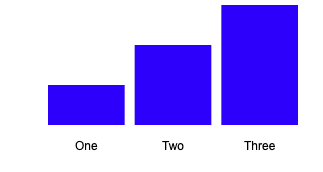

**Test 2: Testa `updateData()`-metoden**

Mål: Att säkerställa att `updateData()`-metoden fungerar korrekt och uppdaterar data för grafen som förväntat.

1. Skapa en ny instans av `BarChart`.
2. Anropa `updateData()`-metoden med en ny uppsättning data.
3. Verifiera att data i diagrammet har uppdaterats korrekt.

**Resultat:**

### Målet uppnådes

```markdown
const barCtx = document.getElementById('barCanvas').getContext('2d')
const barConfig = {
  type: 'bar',
  data: [10, 20, 30],
  labels: ['One', 'Two', 'Three'],
  color: 'blue'
}
const barChart = new MyChart(barCtx, barConfig).init()
barChart.draw()
barChart.toggleGrid(true)
barChart.updateData([40, 50, 60])
```
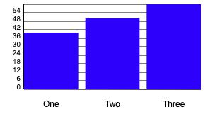


**Test 3: Testa `updateColor()`-metoden**

Mål: Att säkerställa att `updateColor()`-metoden fungerar korrekt och uppdaterar färgen för staplarna i diagrammet som förväntat.

1. Skapa en ny instans av `BarChart`.
2. Anropa `updateColor()`-metoden med en ny färg.
3. Verifiera att färgen på staplarna i diagrammet har uppdaterats korrekt.

**Resultat:**

### Målet uppnådes

```markdown
const barCtx = document.getElementById('barCanvas').getContext('2d')
const barConfig = {
  type: 'bar',
  data: [10, 20, 30],
  labels: ['One', 'Two', 'Three'],
  color: 'blue'
}
const barChart = new MyChart(barCtx, barConfig).init()
barChart.draw()
barChart.toggleGrid(true)
barChart.updateColor('red')
```
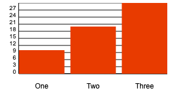

**Test 4: Testa `updateLabels()`-metoden**

Mål: Att säkerställa att `updateLabels()`-metoden fungerar korrekt och uppdaterar etiketterna för diagrammet som förväntat.

1. Skapa en ny instans av `BarChart`.
2. Anropa `updateLabels()`-metoden med en ny uppsättning etiketter.
3. Verifiera att etiketterna i diagrammet har uppdaterats korrekt.

**Resultat:**

### Målet uppnådes

```markdown
const barCtx = document.getElementById('barCanvas').getContext('2d')
const barConfig = {
  type: 'bar',
  data: [10, 20, 30],
  labels: ['One', 'Two', 'Three'],
  color: 'blue'
}
const barChart = new MyChart(barCtx, barConfig).init()
barChart.draw()
barChart.toggleGrid(true)
barChart.updateLabels(['six', 'nine', 'eight'])
```
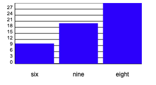

**Test 5: Testa `updateConfig(newConfig)`-metoden**

Mål: Att säkerställa att `updateConfig()`-metoden fungerar som förväntat och uppdaterar konfigurationen korrekt.

1. Skapa en ny instans av `BarChart`.
2. Anropa `updateConfig()`-metoden med nya konfigurationsvärden.
3. Verifiera att konfigurationen har uppdaterats korrekt och att diagrammet har ritats om.

**Resultat:**

### Målet uppnådes

```markdown
const barCtx = document.getElementById('barCanvas').getContext('2d')
const barConfig = {
  type: 'bar',
  data: [10, 20, 30],
  labels: ['One', 'Two', 'Three'],
  color: 'blue'
}
const barChart = new MyChart(barCtx, barConfig).init()
barChart.draw()
barChart.toggleGrid(true)
barChart.updateConfig({ barGap: 20, numGridLines: 5 })
```
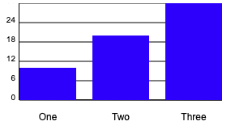

**Test 6: Testa `getData()`-metoden**

Mål: Att säkerställa att `getData()`-metoden fungerar som förväntat och returnerar nuvarande data för diagrammet.

1. Skapa en ny instans av `BarChart`.
2. Anropa `getData()`-metoden.
3. Verifiera att den returnerade datan matchar den datan som diagrammet initialiserades med.

**resultat:**

### Målet uppnådes

```markdown
const barCtx = document.getElementById('barCanvas').getContext('2d')
const barConfig = {
  type: 'bar',
  data: [10, 20, 30],
  labels: ['One', 'Two', 'Three'],
  color: 'blue'
}
const barChart = new MyChart(barCtx, barConfig).init()
barChart.draw()
barChart.toggleGrid(true)
barChart.getData()
console.log(barChart.getData())
```
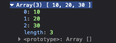

**Test 7: Testa `getConfig()`-metoden**

Mål: Att säkerställa att `getConfig()`-metoden fungerar som förväntat och returnerar nuvarande konfiguration för diagrammet.

1. Skapa en ny instans av `BarChart`.
2. Anropa `getConfig()`-metoden.
3. Verifiera att den returnerade konfigurationen matchar den konfiguration som diagrammet initialiserades med.

**Resultat:**

### Målet uppnådes

```markdown
const barCtx = document.getElementById('barCanvas').getContext('2d')
const barConfig = {
  type: 'bar',
  data: [10, 20, 30],
  labels: ['One', 'Two', 'Three'],
  color: 'blue'
}
const barChart = new MyChart(barCtx, barConfig).init()
barChart.draw()
barChart.toggleGrid(true)
barChart.getData()
console.log(barChart.getConfig())
```

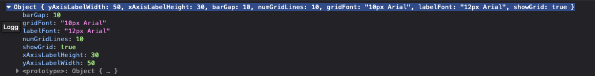

**Test 8: Testa `getChartDimensions()`-metoden**

Mål: Att säkerställa att `getChartDimensions()`-metoden fungerar som förväntat och returnerar nuvarande dimensioner för diagrammet.

1. Skapa en ny instans av `BarChart`.
2. Anropa `getChartDimensions()`-metoden.
3. Verifiera att de returnerade dimensionerna matchar canvas-elementets bredd och höjd.

**Resultat:**

### Målet uppnådes

```markdown
const barCtx = document.getElementById('barCanvas').getContext('2d')
const barConfig = {
  type: 'bar',
  data: [10, 20, 30],
  labels: ['One', 'Two', 'Three'],
  color: 'blue'
}
const barChart = new MyChart(barCtx, barConfig).init()
barChart.draw()
barChart.toggleGrid(true)
barChart.getData()
console.log(barChart.getChartDimensions())
```
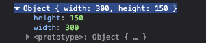

**Test 9: Testa `updateGridFont(newGridFont)`-metoden**

Mål: Att säkerställa att `updateGridFont()`-metoden fungerar som förväntat och uppdaterar typsnittet för rutnätetiketter korrekt.

1. Skapa en ny instans av `BarChart`.
2. Anropa `updateGridFont()`-metoden med ett nytt typsnitt.
3. Verifiera att typsnittet för rutnätetiketter har uppdaterats korrekt och att diagrammet har ritats om.

**Resultat:**

### Målet uppnådes

```markdown
const barCtx = document.getElementById('barCanvas').getContext('2d')
const barConfig = {
  type: 'bar',
  data: [10, 20, 30],
  labels: ['One', 'Two', 'Three'],
  color: 'blue'
}
const barChart = new MyChart(barCtx, barConfig).init()
barChart.draw()
barChart.toggleGrid(true)
barChart.updateGridFont('15px Arial')
```
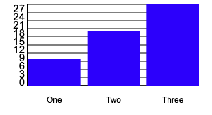

**Test 10: Testa `updateLabelFont(newLabelFont)`-metoden**

Mål: Att säkerställa att `updateLabelFont()`-metoden fungerar som förväntat och uppdaterar typsnittet för etiketter korrekt.

1. Skapa en ny instans av `BarChart`.
2. Anropa `updateLabelFont()`-metoden med ett nytt typsnitt.
3. Verifiera att typsnittet för etiketter har uppdaterats korrekt och att diagrammet har ritats om.

**Resultat:**

### Målet uppnådes

```markdown
const barCtx = document.getElementById('barCanvas').getContext('2d')
const barConfig = {
  type: 'bar',
  data: [10, 20, 30],
  labels: ['One', 'Two', 'Three'],
  color: 'blue'
}
const barChart = new MyChart(barCtx, barConfig).init()
barChart.draw()
barChart.toggleGrid(true)
barChart.updateLabelFont('20px Arial')
```
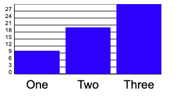

**Test 11: Testa `updateNumGridLines(newNumGridLines)`-metoden**

Mål: Att säkerställa att `updateNumGridLines()`-metoden fungerar som förväntat och uppdaterar antalet rutlinjer korrekt.

1. Skapa en ny instans av `BarChart`.
2. Anropa `updateNumGridLines()`-metoden med ett nytt antal rutlinjer.
3. Verifiera att antalet rutlinjer har uppdaterats korrekt och att diagrammet har ritats om.

**Resultat:**

### Målet uppnådes

```markdown
const barCtx = document.getElementById('barCanvas').getContext('2d')
const barConfig = {
  type: 'bar',
  data: [10, 20, 30],
  labels: ['One', 'Two', 'Three'],
  color: 'blue'
}
const barChart = new MyChart(barCtx, barConfig).init()
barChart.draw()
barChart.toggleGrid(true)
barChart.updateNumGridLines(5)
```
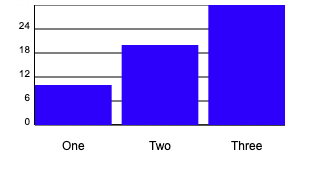

**Test 12: Testa `updateYAxisLabelWidth(newYAxisLabelWidth)`-metoden**

Mål: Att säkerställa att `updateYAxisLabelWidth()`-metoden fungerar som förväntat och uppdaterar bredden för Y-axelns etiketter korrekt.

1. Skapa en ny instans av `BarChart`.
2. Anropa `updateYAxisLabelWidth()`-metoden med ett nytt breddvärde.
3. Verifiera att bredden för Y-axelns etiketter har uppdaterats korrekt och att diagrammet har ritats om.

**Resultat:**

### Målet uppnådes inte

Summering: En metod som inte fungerar som förväntat. Metoden uppdaterar inte bredden för Y-axelns etiketter korrekt.

```markdown
const barCtx = document.getElementById('barCanvas').getContext('2d')
const barConfig = {
  type: 'bar',
  data: [10, 20, 30],
  labels: ['One', 'Two', 'Three'],
  color: 'blue'
}
const barChart = new MyChart(barCtx, barConfig).init()
barChart.draw()
barChart.toggleGrid(true)
barChart.updateYAxisLabelWidth(60)
```

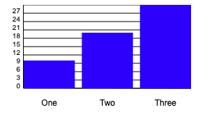

Failed

**Test 13: Testa `updateXAxisLabelHeight(newXAxisLabelHeight)`-metoden**

Mål: Att säkerställa att `updateXAxisLabelHeight()`-metoden fungerar som förväntat och uppdaterar höjden för X-axelns etiketter korrekt.

1. Skapa en ny instans av `BarChart`.
2. Anropa `updateXAxisLabelHeight()`-metoden med ett nytt höjdvärde.
3. Verifiera att höjden för X-axelns etiketter har uppdaterats korrekt och att diagrammet har ritats om.

**Resultat:**

### Målet uppnådes

```markdown
const barCtx = document.getElementById('barCanvas').getContext('2d')
const barConfig = {
  type: 'bar',
  data: [10, 20, 30],
  labels: ['One', 'Two', 'Three'],
  color: 'blue'
}
const barChart = new MyChart(barCtx, barConfig).init()
barChart.draw()
barChart.toggleGrid(true)
barChart.updateXAxisLabelHeight(0)
```
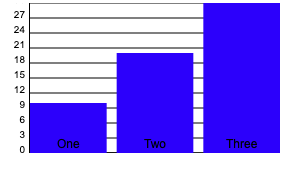

**Test 14: Testa `updateBarGap(newBarGap)`-metoden**

Mål: Att säkerställa att `updateBarGap()`-metoden fungerar som förväntat och uppdaterar mellanrummet mellan staplarna korrekt.

1. Skapa en ny instans av `BarChart`.
2. Anropa `updateBarGap()`-metoden med ett nytt mellanrums värde.
3. Verifiera att mellanrummet mellan staplarna har uppdaterats korrekt och att diagrammet har ritats om.

**Resultat:**

### Målet uppnådes

```markdown
const barCtx = document.getElementById('barCanvas').getContext('2d')
const barConfig = {
  type: 'bar',
  data: [10, 20, 30],
  labels: ['One', 'Two', 'Three'],
  color: 'blue'
}
const barChart = new MyChart(barCtx, barConfig).init()
barChart.draw()
barChart.toggleGrid(true)
barChart.updateBarGap(20)
```
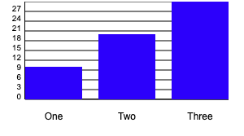

----
toogleGrid metoden behöver ej testning då den har används i alla testfall och fungerar som förväntat.