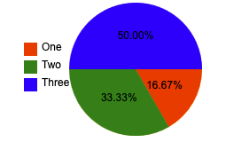

# Testning av PieChart klassen

PieChart-klassen representerar ett pajdiagram och innehåller flera metoder som möjliggör anpassning av diagrammet, till exempel att ändra färg, uppdatera data, och ändra diagrammets konfiguration. Korrekt funktionalitet av dessa metoder är avgörande för att säkerställa att användarna kan anpassa diagrammet efter sina behov och att diagrammet renderas korrekt. Nedan listas testfall som säkerställer att varje metod i klassen fungerar som förväntat.

Förutsättningar: Testerna behöver en 2d-kontext för ett canvas-element samt en konfig för att kunna testas. Konfigurationen för grafen kommer att se likadant ut enligt Test 1.

**Test 1: Testa `draw()`-metoden**

Mål: Att säkerställa att `draw()`-metoden fungerar korrekt och ritar ut grafen som förväntat.

1. Skapa en ny instans av `PieChart`.
2. Anropa `draw()`-metoden.
3. Verifiera att diagrammet ritas korrekt på canvas-elementet med de konfigurationer som angivits.

**Resultat:**

### Målet uppnådes

```markdown
const pieCtx = document.getElementById('pieCanvas').getContext('2d')
const pieConfig = {
  type: 'pie',
  data: [10, 20, 30],
  labels: ['One', 'Two', 'Three'],
  colors: ['yellow', 'orange', 'pink']
}
const pieChart = new MyChart(pieCtx, pieConfig).init()
pieChart.draw()
```


**Test 2: Testa `updateData()`-metoden**

Mål: Att säkerställa att `updateData()`-metoden fungerar korrekt och uppdaterar data för grafen som förväntat.

1. Skapa en ny instans av `PieChart`.
2. Anropa `updateData()`-metoden med en ny uppsättning data.
3. Verifiera att data i diagrammet har uppdaterats korrekt.

**Resultat:**

### Målet uppnådes

```markdown
const pieCtx = document.getElementById('pieCanvas').getContext('2d')
const pieConfig = {
  type: 'pie',
  data: [10, 20, 30],
  labels: ['One', 'Two', 'Three'],
  colors: ['yellow', 'orange', 'pink']
}
const pieChart = new MyChart(pieCtx, pieConfig).init()
pieChart.draw()
pieChart.updateData([80, 100, 42])
```


**Test 3: Testa `updateColors()`-metoden**

Mål: Att säkerställa att `updateColors()`-metoden fungerar korrekt och uppdaterar färgen för segmenten i diagrammet som förväntat.

1. Skapa en ny instans av `PieChart`.
2. Anropa `updateColors()`-metoden med en ny färg.
3. Verifiera att färgen på segmenten i diagrammet har uppdaterats korrekt.

**Resultat:**

### Målet uppnådes

```markdown
const pieCtx = document.getElementById('pieCanvas').getContext('2d')
const pieConfig = {
  type: 'pie',
  data: [10, 20, 30],
  labels: ['One', 'Two', 'Three'],
  colors: ['yellow', 'orange', 'pink']
}
const pieChart = new MyChart(pieCtx, pieConfig).init()
pieChart.draw()
pieChart.updateColors(['red', 'green', 'blue'])
```


**Test 4: Testa `updateLegendLabels()`-metoden**

Mål: Att säkerställa att `updateLegendLabels()`-metoden fungerar korrekt och uppdaterar etiketterna för diagrammet som förväntat.

1. Skapa en ny instans av `PieChart`.
2. Anropa `updateLegendLabels()`-metoden med en ny uppsättning etiketter.
3. Verifiera att etiketterna i diagrammet har uppdaterats korrekt.

**Resultat:**

### Målet uppnådes

```markdown
const pieCtx = document.getElementById('pieCanvas').getContext('2d')
const pieConfig = {
  type: 'pie',
  data: [10, 20, 30],
  labels: ['One', 'Two', 'Three'],
  colors: ['yellow', 'orange', 'pink']
}
const pieChart = new MyChart(pieCtx, pieConfig).init()
pieChart.draw()
pieChart.updateLegendLabels(['A', 'B', 'C'])
```


**Test 5: Testa `updateConfig(newConfig)`-metoden**

Mål: Att säkerställa att `updateConfig()`-metoden fungerar som förväntat och uppdaterar konfigurationen korrekt.

1. Skapa en ny instans av `PieChart`.
2. Anropa `updateConfig()`-metoden med nya konfigurationsvärden.
3. Verifiera att konfigurationen har uppdaterats korrekt och att diagrammet har ritats om.

**Resultat:**

### Målet uppnådes

```markdown
const pieCtx = document.getElementById('pieCanvas').getContext('2d')
const pieConfig = {
  type: 'pie',
  data: [10, 20, 30],
  labels: ['One', 'Two', 'Three'],
  colors: ['yellow', 'orange', 'pink']
}
const pieChart = new MyChart(pieCtx, pieConfig).init()
pieChart.draw()
pieChart.updateConfig({ legendBoxSize: 18, legendSpacing: 2 })
```

